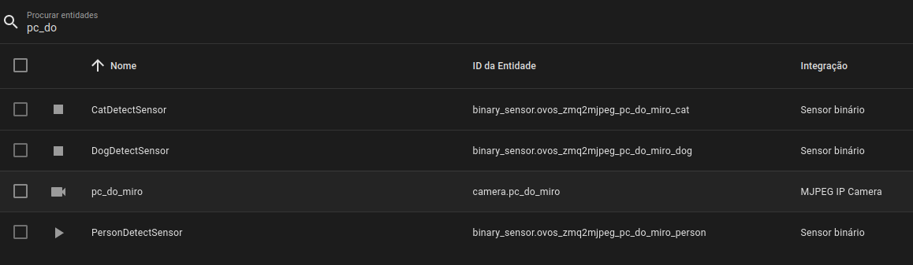

# ZMQ2MJPEG

listens for ZMQ camera from [imagezmq](https://github.com/jeffbass/imagezmq)
- provides MPJEG stream
- performs object detection via mobilenet

integrates with:
- [ovos-PHAL-sensors](https://github.com/OpenVoiceOS/ovos-PHAL-sensors/tree/dev) - provides object detection (person / cat / dog) detection binary sensors
- Home Assistant - provides [ip camera](https://www.home-assistant.io/integrations/mjpeg) + sensors
- OVOS devices (eg, mark2) - [ovos-PHAL-zmqamera](https://github.com/OpenVoiceOS/ovos-PHAL-zmqamera) companion plugin

## Usage

WIP

edit top of server.py for config and run that file
